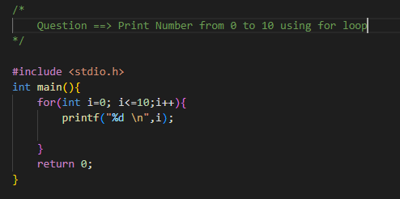

# Loop Control Instructions:

-   loop control instructions are used to control the flow of execution within loops. 
-   These instructions allow you to alter the normal behavior of loops and provide more fine-grained control over the loop's execution.

## Types of Loop:
1) for loop
2) while loop
3) do while loop

## 1) For Loop:
-    The for loop is used when you know exactly how many times you want to repeat a block of code. 
-    It consists of an initialization statement, a conditional expression, and an increment statement, and it continues to execute the code block until the conditional expression becomes false.

## 2) While Loop:
-   The while loop is used when you want to repeat a block of code while a certain condition is true. 
-   It consists of a conditional expression, and the code block continues to execute as long as the expression is true.

   

## 3) Do-while Loop:
-   The do-while loop is similar to the while loop, except that the code block is executed at least once, regardless of whether the conditional expression is true or false. 
-   It consists of the do keyword, followed by the code block, and then the while keyword and the conditional expression.

## Syntax of 3 loops:
-   

# Special Things:

## 1] Increment Operator:
-   2 operators: 1) ++i (Pre Increment)
                 2) i++ (Post Increment)

## 2] Decrement Operator:
-   2 operators: 1) --i (Pre Decrement)
                 2) i-- (Post Decrement)

## 3] Loop counter cab be float or even character:
-   It is possible to use float or character data types as loop counters.

## 4] Infinite Loop:
-    infinite loop is a loop that continues to run indefinitely or until interrupted by an external action.

# Statements:

## 1) Break Statement:
-   break statement is a control statement used to terminate a loop.
-   The break statement is commonly used with a conditional statement to exit a loop early if a certain condition is met.
-   Example:
-   

## 2) Continue Statement:
-   continue statement is a control statement used to skip the current iteration of a loop and continue with the next iteration.
-   The continue statement is commonly used with a conditional statement to skip iterations that do not meet a certain condition.
-   Example:
-   
