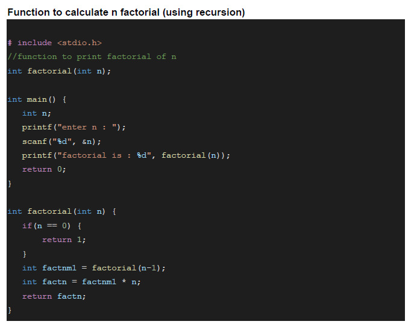

# Recursion:

-   When function calls itself, it's called recursion.

## Properties of Recursion:

-  Anything that can be done with Iteration, can be done with recursion and vice-versa.

-  Recursion can sometimes give the most simple solution.

-   Base case is condition which stops recursion.

-   Iteration has infinite loop and Recursion has stack overflow.

## Example:
-   